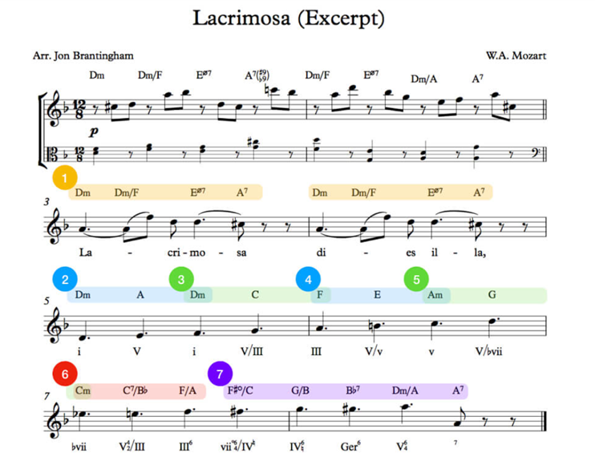

```{r chunk1, setup}
# In order to use these packages, we need to install flexdashboard, plotly, and Cairo.
library(scales)
library(kknn)
library(C50)
library(randomForest)
library(tidyverse)
library(plotly)
library(spotifyr)
library(Cairo)
library(ggplot2)
library(compmus)
source('spotify.R')
library(CGPfunctions)
library(viridis)
library(tidymodels)
library(protoclust)
library(ggdendro)
library(heatmaply)


```


### **Will my Discover Weekly transform into Alex? Differences for Danceability, Energy, Tempo and Instrumentalness**{data-commentary-width=360}

```{r chunk10}


# My Spotify Favorites
favorites=get_playlist_audio_features("Tosca Beijaert","16OAuKPZYr8YM4a9n1V6kf")


# Because there were local files in the list, spotify added extra columns, which i removed as the other
# playlists don't have these comments, so it will be useless for compariosn.
favorites=favorites[-c(59:63)]

# We also have to remove the local files, as i cannot  compare them as there is no analysis for these tracks.
favorites=subset(favorites, track.is_local==FALSE) # we delete the local files


# Alex favorites
alex=get_playlist_audio_features("Alexander Keijser","59c8tug3WdwODj6gV0ierq")

# Discover weekly Favorites week 1
discover_weekly1=get_playlist_audio_features("Tosca Beijaert","1RGiBzoNLHf0GkTYRxDhpY")

# Discover weekly favorites week 2

discover_weekly2=get_playlist_audio_features("Tosca Beijaert", "24kpxnb8oyQykp71Gn3sge")

discover_weekly3=get_playlist_audio_features("Tosca Beijaert","1vOSG6EzDsKLNlvRFEhcjF")

discover_weekly4=get_playlist_audio_features("Tosca Beijaert","2XhLwoBvdUK38ROYUwR1Mg")

discover_weekly5=get_playlist_audio_features("Tosca Beijaert","7okC2wt4u0QtdddWp3Li7Q")

discover_weekly6=get_playlist_audio_features("Tosca Beijaert","5YkD0hqRQ1g6R1PVckNSac")

discover_weekly7=get_playlist_audio_features("Tosca Beijaert","67TgsEi6QAM7fb7RB73N2q")

discover_weekly8=get_playlist_audio_features("Tosca Beijaert","4GhJfgljCrnaIbJ30qIabQ")

# Discover weekly 1 & 2 combined (combined playlists)

# discover_weekly_combined_week2=merge(discover_weekly1[6:16],discover_weekly2.1[6:16])
#View(discover_weekly_combined_week2) # WHY DOES THIS NOT WORK???A


# Discover Weekly Archive

discover_weekly_archive=get_playlist_audio_features("Tosca Beijaert", "4jLB65Tpbt91Ta2QrypTFV")


playlists=
  alex %>% mutate(playlist = "Alex") %>%
  bind_rows(favorites %>% mutate(playlist = "Favorites")) %>%
  bind_rows(discover_weekly1%>% mutate(playlist = "Discover Weekly 1"))


# We need some samples of the playlists of the favorites as they are too big.
fav_sample=favorites[sample(nrow(favorites),500),]
alex_sample=alex[sample(nrow(alex),500),]

playlists_sample=
  alex_sample %>% mutate(playlist = "Alex Sample") %>%
  bind_rows(fav_sample %>% mutate(playlist = "Favorites Sample")) %>%
  bind_rows(discover_weekly1%>% mutate(playlist = "Discover Weekly Base"))


# The Plot of 3 variables

playlists_sample %>%
  ggplot(aes(x = energy, y=danceability, col=instrumentalness)) + # Add tempo to size here
  geom_point() +
  geom_rug(size = 0.1)+
  facet_wrap(~ playlist)+
  labs(title='Energy, Danceability, Instrumentalness and Tempo per Playlist') +
  scale_x_continuous(          # Fine-tune the x axis.
    limits = c(0, 1),
    breaks = c(0, 0.50, 1),  # Use grid-lines for quadrants only.
    minor_breaks = NULL      # Remove 'minor' grid-lines.
  ) +
  scale_y_continuous(          # Fine-tune the y axis in the same way.
    limits = c(0, 1),
    breaks = c(0, 0.50, 1),
    minor_breaks = NULL
  ) +
  theme_classic() +              # Use a simpler them.
  labs(                        # Make the titles nice.
    x = "Energy",
    y = "Danceability",
    colour = "Instrumentalness",
    size="Tempo"
  ) + scale_color_viridis( option = "D")


# Second plot
 ggplot(playlists_sample, aes(energy, danceability, col=playlist))+
   geom_jitter(alpha=0.5)+
   geom_smooth() +
   labs(
     title = "Energy & Danceability Per Playlist",
     x = "Energy",
     y = "Danceability",
     col="Playlist"
   )
 
 # gridExtra::grid.arrange(plot1, plot2, ncol = 1, nrow = 2)

```


***

My Favourites playlist in Spotify, the playlist of my boyfriend Alex and my discover weekly differ quite a lot. Assuming that discover weekly adapts to what you listen to the most ( [this article](https://qz.com/571007/the-magic-that-makes-spotifys-discover-weekly-playlists-so-damn-good/)),

I will perform an experiment where I will listen __ONLY__ to my boyfriends playlist for the coming 8 weeks, to see if my Discover Weekly will transform to look lilke my Boyfriends playlist.

The most interesting features to me seem to be Danceability, Energy, Instrumentalness and Tempo.

On the left we see a plot for the Energy, Danceability and Instrumentalness for each playlist, where we use the data of week 1 for discover weekly. The plot wasn't very interpretable when using all the data from Alex's and my playlist, as they have so many songs. Thus, I have randomly sampled 500 songs from Alex's and my Favorites, to make it more clear-cut. Also we can observe that my Favorite's has some more songs which are less danceable than Alex's playlist and discover weekly. And that in general, discover weakly has less of a spread for danceability and energy.

The left plot however is hard to interpret, therefore we could look for instance just at the danceability and energy of each playlist. This is what we see on the right.
This shows us very clearly that spotify weekly's data isn't very spread. For instance, looking at the green line, we can see that the danceability nor the energy go below 0.3 for discover weekly. However, these two plots don't show us that well how any of the variables are distributed. THus we will look at some histograms per feature.

### **The Baseline differences: the distributions of the features**{data-commentary-width=530}

```{r chunk11}


# MAKING PLOTS.

# We will now start making plots. We want 1 plot that compares the 3 playlists & 1 plot that compares the
# discover weekly playlists over time.

# Comparing the 3 playlists.
# we combine the 3 data sets favorites, alex and discover weekly archive.


# 1. We start with the baseline differences for alex's favourties, my faovrites and discover weekly week 1.

playlists %>%
  ggplot(aes(x = energy, col=playlist)) +
  geom_histogram() +
  facet_wrap(~ playlist, scales="free_y")+
  scale_x_continuous(
    limits=c(0,1),
    breaks=c(0,0.5,1)
  )+
  labs(color='Playlist', title='Energy per Playlist') +
  xlab('Energy') +
  ylab("Count")


playlists %>%
ggplot(aes(x = tempo,  col=playlist)) +
geom_histogram() +
facet_wrap(~ playlist, scales="free_y")+
scale_x_continuous(
limits=c(0,250),
breaks=c(0,125,250)
)+
labs(color='Playlist', title='Tempo per Playlist') +
xlab('Tempo')+
ylab("Count")+
theme_get()


playlists %>%
ggplot(aes(x = danceability, col=playlist)) +
geom_histogram() +
facet_wrap(~ playlist, scales="free_y")+
scale_x_continuous(
limits=c(0,1),
breaks=c(0,0.5,1)
)+
labs(color='Playlist', title='Danceability per Playlist') +
xlab('Danceability') +
ylab("Count")+
theme_get()

playlists %>%
ggplot(aes(x = instrumentalness, col=playlist)) +
geom_histogram() +
facet_wrap(~ playlist, scales="free_y")+
scale_x_continuous(
limits=c(0,1),
breaks=c(0,0.5,1)
)+
labs(color='Playlist', title='Instrumentalness per Playlist') +
xlab('Instumentalness') +
ylab("Count")+
theme_get()


```

***

Here we look at some baseline comparisons, as these are important to look at them later on again. For every plot you get a specific feature on the x-axis and the amount on the y-axis. Note that the values of the y-axes differ for the playlists, as discover weekly only has 30 songs and the other 2 have around 3000 songs. These plots clearly show the differences of how the songs are distributed for the different playlists.

For instance, Discover weekly has less energetic songs than the other two. The tempo mostly lies around 125 bmp, whereas the other 2 are more spread.

We now see that only information on the mean of the data, does not give us enough. The means might not always lie that far apart, but if we look at the distributions, we can easily see the differences.


Looking at the plots and histograms we noticed that the playlists are distributed differently. We hypothesize a few things about the changes in the discover weekly playlist over 8 weeks time:


|  Hypothesis | Discover Weekly After 8 Weeks  |
|---|---|
| Energy  | Will go up  |
|  Tempo |  Will go up |
|  Danceability | Will go up  |
| Instrumentalness  | Will go up  |


From the histograms we can tell that most of Alex's songs are high in energy, therefore we hypothesize that discover weekly will go up in energy. Looking at the histograms, we can see that Alex's favorites have more songs with a higher tempo than discover weekly, therefore we hypothesize this value to go up. Even though by looking at the histograms, the danceability of discover weekly and alex's favorites look about the same, tempo and danceability are highly correlated, therefore we also expect danceability to go up in value. We cannot see big changes in the instrumentalness between discover weekly and alex's playlist, however, I know that alex's playlist has a lot of techno songs, thus a high instrumentalness, therefore we hypothesize instrumentalness will go up.

These tables don't show much difference in the mean values, however the histograms showed us very clear differences. This shows once again that you shouldn't look only at the average values.

**My Favourites**

|Feature   |Mean   |SD   |
|---|---|---|
| Danceability  | 0.567  |0.184   |
| Energy  | 0.635  |  0.265  |
| Instrumentalness  | 0.329   | 0.373  |
| Tempo  |  124  | 31  |


**Alex's Favourites**

| Feature  |Mean   |SD   |
|---|---|---|
| Danceability  | 0.693   |0.125   |
| Energy  | 0.664   |  0.167  |
| Instrumentalness  | 0.530    | 0.351  |
| Tempo  |   116   | 16   |


**Discover Weekly 1**

|Feature   |Mean   |SD   |
|---|---|---|
| Danceability  | 0.717   |0.138   |
| Energy  | 0.681  |  0.184  |
| Instrumentalness  | 0.505  | 0.391  |
| Tempo  |  121 | 19.8   |


###**The Key of our Playlists**

```{r chunk2, fig.width=10, fig.height=7}

# We make the Key histograms
playlists_end=
  alex %>% mutate(playlist = "Alex") %>%
  bind_rows(favorites %>% mutate(playlist = "Favorites")) %>%
  bind_rows(discover_weekly1%>% mutate(playlist = "Discover Weekly 1"))

key_x=c("C","C#|Db", "D","D#|Eb" ,"E", "F", "F#|Gb", "G", "G#|Ab", "A", "A#|Bb", "B" ) # Vector with label for the x-axis

key_per_playlist=
  playlists_end %>%
  ggplot(aes(x = key, col=playlist)) +
  geom_bar() +
  facet_wrap(~ playlist, scales="free_y")+
  labs(color='Playlist', title='Key per Playlist') +
  xlab('Key') +
  ylab("Count")+
  scale_x_continuous(
    labels= key_x,
    breaks = c(0,1,2,3,4,5,6,7,8,9,10,11)         # Fine-tune the x axis.
     # Use grid-lines for quadrants only.      # Remove 'minor' grid-lines.
  )

key_per_playlist + theme(axis.text.x= element_text(face="plain" ,angle=45, hjust=1))


```

***

Here we see the distributions of the keys per playlist at the baseline. You can see that for every playlist, a lot of the songs are in the key of C. However, there are also a lot for C#|Db, G & A. Alex told me that he really like the key of Db, giving us an explanation for why that occurs so often in his playlist. We see that for discover weekly 1, G occurs most often. This makes sense as the key of G is quite popular and spotify weekly in general recommends songs that are popular. I do not have an explanation for my Favorites, I don't have a particular preference. Which you can see a little bit, as multiple keys occur with a high frequency, e.g. C, D, G and A.


### **Alex's least Danceable Song: Lacrimosa VS my Lacrimosa**


```{r chunk3}
# library(png)
# library(grid)
# img <- readPNG("lacrimosa.png")
# grid.raster(img)
library(knitr)

```


***

After doing some research, I found out that Alex's least danceable song is Lacrimosa, from Amadeus Mozart, which is quite funny as it is one of our favorite classical music songs, which we sing all the time. Now I know that Lacrimosa is played in d-minor, which will help us later on. THe songs has some very particular Harmonic orders, for instance for the first few beats: I-II-V-I-II-V. This can also be seen in the picture.

An explanation used of the harmonics & emotions of this song can be found in this [video!](https://www.youtube.com/watch?v=D8SD3ToKDsw). Please watch it, even if you only look at it for 2 seconds, it's really interesting!

Luckily for me, I also have Lacrimosa in my playlist, however mine is a slightly different version from the Choir of King's College, meaning there might be some more polyphonic parts in this version. Also for my version the tempo is a little bit higher and the tuning seems to be a bit tuned down.


### **The Chroma of Lacrimosa seems hard to analyze?**{data-commentary-width=500}

```{r chunk4}

circshift <- function(v, n) {if (n == 0) v else c(tail(v, n), head(v, -n))}

    # C     C#    D     Eb    E     F     F#    G     Ab    A     Bb    B
major_chord <-
    c(1,    0,    0,    0,    1,    0,    0,    1,    0,    0,    0,    0)
minor_chord <-
    c(1,    0,    0,    1,    0,    0,    0,    1,    0,    0,    0,    0)
seventh_chord <-
    c(1,    0,    0,    0,    1,    0,    0,    1,    0,    0,    1,    0)

major_key <-
    c(6.35, 2.23, 3.48, 2.33, 4.38, 4.09, 2.52, 5.19, 2.39, 3.66, 2.29, 2.88)
minor_key <-
    c(6.33, 2.68, 3.52, 5.38, 2.60, 3.53, 2.54, 4.75, 3.98, 2.69, 3.34, 3.17)

chord_templates <-
    tribble(
        ~name  , ~template,
        'Gb:7'  , circshift(seventh_chord,  6),
        'Gb:maj', circshift(major_chord,    6),
        'Bb:min', circshift(minor_chord,   10),
        'Db:maj', circshift(major_chord,    1),
        'F:min' , circshift(minor_chord,    5),
        'Ab:7'  , circshift(seventh_chord,  8),
        'Ab:maj', circshift(major_chord,    8),
        'C:min' , circshift(minor_chord,    0),
        'Eb:7'  , circshift(seventh_chord,  3),
        'Eb:maj', circshift(major_chord,    3),
        'G:min' , circshift(minor_chord,    7),
        'Bb:7'  , circshift(seventh_chord, 10),
        'Bb:maj', circshift(major_chord,   10),
        'D:min' , circshift(minor_chord,    2),
        'F:7'   , circshift(seventh_chord,  5),
        'F:maj' , circshift(major_chord,    5),
        'A:min' , circshift(minor_chord,    9),
        'C:7'   , circshift(seventh_chord,  0),
        'C:maj' , circshift(major_chord,    0),
        'E:min' , circshift(minor_chord,    4),
        'G:7'   , circshift(seventh_chord,  7),
        'G:maj' , circshift(major_chord,    7),
        'B:min' , circshift(minor_chord,   11),
        'D:7'   , circshift(seventh_chord,  2),
        'D:maj' , circshift(major_chord,    2),
        'F#:min', circshift(minor_chord,    6),
        'A:7'   , circshift(seventh_chord,  9),
        'A:maj' , circshift(major_chord,    9),
        'C#:min', circshift(minor_chord,    1),
        'E:7'   , circshift(seventh_chord,  4),
        'E:maj' , circshift(major_chord,    4),
        'G#:min', circshift(minor_chord,    8),
        'B:7'   , circshift(seventh_chord, 11),
        'B:maj' , circshift(major_chord,   11),
        'D#:min', circshift(minor_chord,    3))

key_templates <-
    tribble(
        ~name    , ~template,
        'Gb:maj', circshift(major_key,  6),
        'Bb:min', circshift(minor_key, 10),
        'Db:maj', circshift(major_key,  1),
        'F:min' , circshift(minor_key,  5),
        'Ab:maj', circshift(major_key,  8),
        'C:min' , circshift(minor_key,  0),
        'Eb:maj', circshift(major_key,  3),
        'G:min' , circshift(minor_key,  7),
        'Bb:maj', circshift(major_key, 10),
        'D:min' , circshift(minor_key,  2),
        'F:maj' , circshift(major_key,  5),
        'A:min' , circshift(minor_key,  9),
        'C:maj' , circshift(major_key,  0),
        'E:min' , circshift(minor_key,  4),
        'G:maj' , circshift(major_key,  7),
        'B:min' , circshift(minor_key, 11),
        'D:maj' , circshift(major_key,  2),
        'F#:min', circshift(minor_key,  6),
        'A:maj' , circshift(major_key,  9),
        'C#:min', circshift(minor_key,  1),
        'E:maj' , circshift(major_key,  4),
        'G#:min', circshift(minor_key,  8),
        'B:maj' , circshift(major_key, 11),
        'D#:min', circshift(minor_key,  3))

lacrimosa =
    get_tidy_audio_analysis("1UvaZaHkh3D9AkmBrrnbFg") %>%
    select(segments) %>% unnest(segments) %>%
    select(start, duration, pitches)

lacrimosa2 =
    get_tidy_audio_analysis("3oHSL6pt9LpNrQZuQGu9wL") %>%
    select(segments) %>% unnest(segments) %>%
    select(start, duration, pitches)

lacrimosa %>%
    mutate(pitches = map(pitches, compmus_normalise, 'euclidean')) %>% # Change Euclidean to something you want: manhattan, euclidean or chebyshev
    compmus_gather_chroma %>%
    ggplot(
        aes(
            x = start + duration / 2,
            width = duration,
            y = pitch_class,
            fill = value)) +
  scale_fill_viridis_c(option = 'C', guide = ) +
    geom_tile() +
    labs(title= "Chromaplot: Alex's Lacrimosa",x = 'Time (s)', y = NULL, fill = 'Magnitude') +
    theme_classic()

lacrimosa2 %>%
    mutate(pitches = map(pitches, compmus_normalise, 'euclidean')) %>% # Change Euclidean to something you want: manhattan, euclidean or chebyshev
    compmus_gather_chroma %>%
    ggplot(
        aes(
            x = start + duration / 2,
            width = duration,
            y = pitch_class,
            fill = value)) +
    scale_fill_viridis_c(option = 'C', guide = ) +
    geom_tile() +
    labs(title= "Chromaplot: My Lacrimosa",x = 'Time (s)', y = NULL, fill = 'Magnitude') +
    theme_classic()

lacrimosa_key <-
    get_tidy_audio_analysis('1UvaZaHkh3D9AkmBrrnbFg') %>%
    compmus_align(sections, segments) %>%
    select(sections) %>% unnest(sections) %>%
    mutate(
        pitches =
            map(segments,
                compmus_summarise, pitches,
                method = 'mean', norm = 'manhattan'))

lacrimosa_key2 <-
    get_tidy_audio_analysis('3oHSL6pt9LpNrQZuQGu9wL') %>%
    compmus_align(sections, segments) %>%
    select(sections) %>% unnest(sections) %>%
    mutate(
        pitches =
            map(segments,
                compmus_summarise, pitches,
                method = 'mean', norm = 'manhattan'))


lacrimosa_key %>%
    compmus_match_pitch_template(key_templates, 'cosine', 'euclidean') %>%
    ggplot(
        aes(x = start + duration / 2, width = duration, y = name, fill = d)) +
    geom_tile() +
    scale_fill_viridis_c(option = 'D') +
    labs(title= "Key-Plot: Alex's Lacrimosa",x = 'Time (s)', y = NULL, fill = 'Magnitude')+
    theme_minimal() +
    labs(x = 'Time (s)', y = '')

lacrimosa_key2 %>%
    compmus_match_pitch_template(key_templates, 'cosine', 'euclidean') %>%
    ggplot(
        aes(x = start + duration / 2, width = duration, y = name, fill = d)) +
    geom_tile() +
    labs(title= "Key-Plot: My Lacrimosa",x = 'Time (s)', y = NULL, fill = 'Magnitude')+
    scale_fill_viridis_c(option = 'D') +
    theme_minimal() +
    labs(x = 'Time (s)', y = '')


```


***


Looking at the chroma plots we can sort of see that this song is played in d minor, which consists of D, E, F, G, A, B???, and C. But the plot is not very easy to read, changing the normalisation or the colors also did not make the chroma plots much clearer.

For Alex's Lacrimosa we see some activity around A & D. My Lacrimosa has some activity around A, D & Db. The fact that both D & Db are showing on the plot might have something to do with the tuning of the song.


Alex's Lacrimosa by Lisa Beckley

<html>
<audio controls>
  <source src="Lacrimosa_Alex.mp3" type="audio/mpeg">
</audio>
</html>


My Lacrimosa from the Choir of Kings college

<html>
<audio controls>
  <source src="Lacrimosa_Tosca.mp3" type="audio/mpeg">
</audio>
</html>


The key-plots are again not very easy to read. One weird thing would be around 170 seconds (2:50) for Alex's Lacrimosa and around 155 seconds (2:35) for my Lacrimosa. In both songs this is the same moment ofcourse, the time difference is only because my version of Lacrimosa has a higher tempo. This moment seems to be around a part where the vocals are a bit softer compared to the rest of the song, and also it's a part that's new, so it hasn't happened before in the song. It's part that first buildsup softly and then goes down again.

### **Then what about Dynamic Time Warping the two lacrimosa's. That does seem to work!**


```{r chunk5}

compmus_long_distance(
    lacrimosa %>% mutate(pitches = map(pitches, compmus_normalise, 'manhattan')), # You only need to change the names of your trakcs, so in this case the tallis and chapelle. Also change your norm to what you want, bv euclidean and change the distances (method)
    lacrimosa2 %>% mutate(pitches = map(pitches, compmus_normalise, 'manhattan')),
    feature = pitches,
    method = 'manhattan') %>%
    ggplot(
        aes(
            x = xstart + xduration / 2,
            width = xduration,
            y = ystart + yduration / 2,
            height = yduration,
            fill = d)) +
    geom_tile() +
    scale_fill_continuous(type = 'viridis', guide = 'none') +
    labs(title= "Dynamic Time Warp",x = 'Alex his Lacrimosa', y = 'My Lacrimosa') +
    theme_classic() # The diagnoal line represent the dynamic time warp.

```

***


Now we can use Dynamic Time Warping to compute the most optimal alignment between the two features sequences. As chroma norm and distance measure manhattan was chosen, the other options did not seem to work well for this data. We can see the black line diagonally, expressing the optimal warping path. Meaning that it is possible to align these two different versions.


### **What about techno/breakbeat songs? Introducing Brainstorm from Special Request! The Chroma does not say much, Timbre to the rescue!**


```{r chunk6}

Brainstorm_Chroma=
    get_tidy_audio_analysis("4GdOWNJzpTWoKdA4LEbXDa") %>%
    select(segments) %>% unnest(segments) %>%
    select(start, duration, pitches)

# Chroma using Euclidean: Werkt
Brainstorm_Chroma%>%
    mutate(pitches = map(pitches, compmus_normalise, 'euclidean')) %>% # Change Euclidean to something you want: manhattan, euclidean or chebyshev
    compmus_gather_chroma %>%
    ggplot(
        aes(
            x = start + duration / 2,
            width = duration,
            y = pitch_class,
            fill = value)) +
    geom_tile() +
    labs(title= "Brainstorm by Special Request Chroma",x = 'Time (s)', y = NULL, fill = 'Magnitude') +
    scale_fill_viridis_c(option = 'A') + # You can change this color, this one is very nice.
    theme_classic()


# The timbre plots of Brainstorm Special Request, which has a big difference at 60 seconds, 100sec,130sec (piano), 145 (vocal), repeat brainstorm, 244 (vocal again), 304 (new thing).We can also see that around 130 second a new block starts (2:10), this is were the piano comes in. At like 190sec (3:08) the same part is repeated that starts at 60 seconds! Listen to the file to find out!

Brainstorm_Timbre <-
    get_tidy_audio_analysis('4GdOWNJzpTWoKdA4LEbXDa') %>%
    compmus_align(bars,segments) %>% # aligns everything at a higher lvl of the spotify fpi, he first argument of compmus align can be bars, beats or section.
    select(bars) %>% unnest(bars) %>%
    mutate(
        pitches = # gives pitch information
            map(segments,
                compmus_summarise, pitches,
                method = 'mean', norm ='euclidean' )) %>% # You can change the method to rms, mean, max and so on, see table (method summary). You can also change the norm again, see table
    mutate(
        timbre = #gives timbre information
            map(segments,
                compmus_summarise, timbre,
                method = 'rms')) # You can change the method again.

Brainstorm_Timbre %>%
    compmus_gather_timbre %>% # You can leave this alone, you don't need to change anything here.
    ggplot(
        aes(
            x = start + duration / 2,
            width = duration,
            y = basis,
            fill = value)) +
    geom_tile() +
    labs(title="Brainstorm by Special Request Timbre",x = 'Time (s)', y = NULL, fill = 'Magnitude') +
    scale_fill_viridis_c(option = 'A') + # You can change this color, this one is very nice.
    theme_classic()

# Pairwise SImilarity Matrix: Werkt


```

***

We are going to look at a song called Brainstorm from Special Request. This is an techno-like song which has a lot of changes troughout the song. There is some piano involved and some singing, however not troughout the whole song. Therefore it is difficult to see something out of the chroma plot, as it's not as easy as with classical music.
This can be seen from the chroma plot. On the x-axis we have the time and on the y-axis the chroma. It's hard to conclude anything from this plot at all.

The timbre shows a little bit better what's going on. The song starts with a slow buildup with some high heads and some minimal vocals (Kicking up in the brainstorm), which you can see in the beginning. Then you can see a very big change around 60 seconds, this is where a very heavy bass kicks in. It also shows a single weird moment around 240 seconds, this is because here there is 1 small sample of a vocal which has not been in the song before and is only played here.

### **SSM matrixes Showing us what's actually going on.**{data-commentary-width=480}

```{r Langzamechunk7}
# The SSM of the Chroma

moments_y=c("Buildup-0 sec","Bass Block-60 sec", "Bass Block + High Heads-100 sec", "Piano-130 sec", "Bass Block + High Heads-190 sec", "Piano-244 sec", "Outro-305 sec") # Vector with label for the x-axis

moments_x=c("Buildup - 0s","Bass Block - 60s", "Bass Block + HH - 100s", "Piano - 130s", "Bass Block + HH - 190s", "Piano - 244s", "Outro - 305s") # Vector with label for the x-axis

SSM_Chroma=Brainstorm_Chroma %>%
    compmus_self_similarity(pitches, 'cosine') %>%  # Here you can change the secon argument again, meaning you change the distance.
    ggplot(
        aes(
            x = xstart + xduration / 2,
            width = xduration,
            y = ystart + yduration / 2,
            height = yduration,
            fill = d)) +
    geom_tile() +
    coord_fixed() +
    scale_fill_viridis_c(option = 'B', guide = 'none') +
      theme_classic() +
  scale_x_continuous(
    breaks = c(0,60,100,130,190,244,305),  # Use grid-lines for quadrants only.
    labels=moments_x,
    minor_breaks = NULL      # Remove 'minor' grid-lines.
    ) +
  scale_y_continuous(          # Fine-tune the y axis in the same way.
    breaks = c(0,60,100,130,190,244,305),
    labels=moments_y,
    minor_breaks = NULL
  ) +
  labs(title='Chroma SSM', x="", y="")


SSM_Chroma + theme(axis.text.x= element_text(face="plain" ,angle=45, hjust=1))

# Euclidean as distance: You can see the big change at 60 seconds very well.

Brainstorm_Timbre %>%  # Timbre self similairity matrix
    compmus_self_similarity(timbre, 'euclidean') %>%  # Here you can change the secon argument again, meaning you change the distance.
    ggplot(
        aes(
            x = xstart + xduration / 2,
            width = xduration,
            y = ystart + yduration / 2,
            height = yduration,
            fill = d)) +
    geom_tile() +
    coord_fixed() +
    scale_fill_viridis_c(option = 'B', guide = 'none') +
    theme_classic() +
    labs(title="Timbre SSM Using Euclidean Distance",x = 'Time (s)', y = 'Time (s)')+
  scale_x_continuous(
    breaks = c(0,60,100,130,190,244,305), minor_breaks=NULL) +
  scale_y_continuous(
    breaks = c(0,60,100,130,190,244,305),minor_breaks=NULL)


# Cosine as distance: You can see small differences better.
Brainstorm_Timbre %>%  # Timbre self similairity matrix
    compmus_self_similarity(timbre, 'cosine') %>%  # Here you can change the secon argument again, meaning you change the distance.
    ggplot(
        aes(
            x = xstart + xduration / 2,
            width = xduration,
            y = ystart + yduration / 2,
            height = yduration,
            fill = d)) +
    geom_tile() +
    coord_fixed() +
    scale_fill_viridis_c(option = 'B', guide = 'none') +
    theme_classic() +
    labs(title="Timbre SSM Using Cosine Distance",x = 'Time (s)', y = 'Time (s)')+
  scale_x_continuous(
    breaks = c(0,60,100,130,190,244,305), minor_breaks=NULL) +
  scale_y_continuous(
    breaks = c(0,60,100,130,190,244,305),minor_breaks=NULL)


```

***

The chroma plot did not give us much information, however the Chroma SSM gives us loads of info. Using Cosine as the distance for the timbre SSM, we get more structure into the plot, however the very obvious changes we mentioned before become less obvious. But differences between certain blocks become more obvious, depending on what you want to show people you can make a choice.

On the x-axis and the y-axis we can see the names describing the __start__ of a new music block. For instance, the song starts with a slow buildup at 0 sec untill around 60 sec (1:00), here a new block starts with some heavy bass, then at 100 sec (1:40) the block is still the same as before, but the high heads kick in. At 130 sec (2:10) the Piano block starts, where at 190 sec (3:08) the Bass block with high heads is repeated. Then at 244 sec (4:05) the Piano block is repeated and at 305 sec (5:02) the autro block starts.
Listen to the [song](https://www.youtube.com/watch?v=DvJianRCqZk) to find out!

<html>
<audio controls>
  <source src="Brainstorm Special Request.mp3" type="audio/mpeg">
</audio>
</html>

If we look at the Timbre SSM again we see the breakdown at 60 seconds, this time even more clearly. As the song starts with some bass, high heads and some low vocals all of a sudden at 60 seconds a lot of low bass is added and this is easy to see by the yellow line at 60 seconds. Also we see a clear change at 244 seconds (4:02-4:05). This is because of that one weird vocal sample that is only played here.

### **Interactive Timbre SSM**

```{r chunk8}


brain_active=Brainstorm_Timbre %>%  # Timbre self similairity matrix
    compmus_self_similarity(timbre, 'euclidean') %>%  # Here you can change the secon argument again, meaning you change the distance.
    ggplot(
        aes(
            x = xstart + xduration / 2,
            width = xduration,
            y = ystart + yduration / 2,
            height = yduration,
            fill = d)) +
    geom_tile() +
    coord_fixed() +
    scale_fill_viridis_c(option = 'B', guide = 'none') +
    theme_classic() +
    labs(title="Timbre SSM",x = 'Time (s)', y = 'Time (s)')+
  scale_x_continuous(
    breaks = c(0,60,100,130,190,244,305), minor_breaks=NULL) +
  scale_y_continuous(
    breaks = c(0,60,100,130,190,244,305),minor_breaks=NULL)

ggplotly(brain_active)

```

***

Here we see the SSM of Timbre again, but as an interactive plot.

Take a look at the file again to check the specific moments.

- Slow buildup 0 sec
- Bass block 60 sec (1:00)
- Bass block + High Heads 100 sec (1:40)
- Piano block 130 sec (2:10)
- Bass block + High Heads 190 sec (3:08)
- Piano block 244 sec (4:05), where the one weird vocal sentence starts at 4:03
- Autro block 305 sec (5:02)

<html>
<audio controls>
  <source src="Brainstorm Special Request.mp3" type="audio/mpeg">
</audio>
</html>


### **Novelty functions, Chromagrams and Delta-delta's for Lacrimosa & Brainstorm. Can the beats be derived?**

```{r}

brain <-
    get_tidy_audio_analysis("4GdOWNJzpTWoKdA4LEbXDa") %>%
    select(segments) %>% unnest(segments)

lacrimosa_novelty <-
    get_tidy_audio_analysis("1UvaZaHkh3D9AkmBrrnbFg") %>%
    select(segments) %>% unnest(segments)

brain %>%
    mutate(loudness_max_time = start + loudness_max_time) %>%
    arrange(loudness_max_time) %>%
    mutate(delta_loudness = loudness_max - lag(loudness_max)) %>%
    ggplot(aes(x = loudness_max_time, y = pmax(0, delta_loudness))) +
    geom_line() +
    xlim(0, 60) + # You can change the x limit, to change the section of the song where you want to look at.
    theme_minimal() +
    labs(x = 'Time (s)', y = 'Novelty', title="Brainstorm Novelty Function Until 60s")

lacrimosa_novelty %>%
    mutate(loudness_max_time = start + loudness_max_time) %>%
    arrange(loudness_max_time) %>%
    mutate(delta_loudness = loudness_max - lag(loudness_max)) %>%
    ggplot(aes(x = loudness_max_time, y = pmax(0, delta_loudness))) +
    geom_line() +
    xlim(0, 30) + # You can change the x limit, to change the section of the song where you want to look at.
    theme_minimal() +
    labs(x = 'Time (s)', y = 'Novelty', title="Lacrimosa Novelty Function Until 30s")

brain %>%
    mutate(loudness_max_time = start + loudness_max_time) %>%
    arrange(loudness_max_time) %>%
    mutate(delta_loudness = loudness_max - lag(loudness_max)) %>%
    ggplot(aes(x = loudness_max_time, y = pmax(0, delta_loudness))) +
    geom_line() +
    xlim(60, 110) + # You can change the x limit, to change the section of the song where you want to look at.
    theme_minimal() +
    labs(x = 'Time (s)', y = 'Novelty', title="Brainstorm Novelty Function From 60s: Buildup")

lacrimosa_novelty %>%
    mutate(loudness_max_time = start + loudness_max_time) %>%
    arrange(loudness_max_time) %>%
    mutate(delta_loudness = loudness_max - lag(loudness_max)) %>%
    ggplot(aes(x = loudness_max_time, y = pmax(0, delta_loudness))) +
    geom_line() +
    xlim(26, 52) + # You can change the x limit, to change the section of the song where you want to look at.
    theme_minimal() +
    labs(x = 'Time (s)', y = 'Novelty', title="Lacrimosa Novelty Function From 26s: Vocal Buildup")

brain%>% # These are just deltas
    mutate(pitches = map(pitches, compmus_normalise, 'clr')) %>%
    arrange(start) %>%
    mutate(pitches = map2(pitches, lag(pitches), `-`)) %>%
    compmus_gather_chroma %>%
    ggplot(
        aes(
            x = start + duration / 2,
            width = duration,
            y = pitch_class,
            fill = pmax(0, value))) +
    geom_tile() +
    scale_fill_viridis_c(option = 'E', guide = 'none') +
    xlim(0, 30) +
    labs(x = 'Time (s)', y = NULL, fill = 'Magnitude',  title="Brainstorm Delta-Chroma") +
    theme_classic()

lacrimosa_novelty%>% # These are just deltas
    mutate(pitches = map(pitches, compmus_normalise, 'clr')) %>%
    arrange(start) %>%
    mutate(pitches = map2(pitches, lag(pitches), `-`)) %>%
    compmus_gather_chroma %>%
    ggplot(
        aes(
            x = start + duration / 2,
            width = duration,
            y = pitch_class,
            fill = pmax(0, value))) +
    geom_tile() +
    scale_fill_viridis_c(option = 'E', guide = 'none') +
    xlim(0, 30) +
    labs(x = 'Time (s)', y = NULL, fill = 'Magnitude',  title="Lacrimosa Delta-Chroma") +
    theme_classic()

brain %>%  # These are delta deltaas: To get delta deltas je change the lag in the 3d rule.
    arrange(start) %>%
    mutate(timbre = map2(timbre, lag(timbre), `-`)) %>%
    compmus_gather_timbre %>%
    ggplot(
        aes(
            x = start + duration / 2,
            width = duration,
            y = basis,
            fill = pmax(0, value))) +
    geom_tile() +
    scale_fill_viridis_c(option = 'E', guide = 'none') +
    xlim(0, 30) +
    labs(x = 'Time (s)', y = NULL, fill = 'Magnitude',  title="Brainstorm Delta-Delta-Timbre") +
    theme_classic()

lacrimosa_novelty %>%  # These are delta deltaas: To get delta deltas je change the lag in the 3d rule.
    arrange(start) %>%
    mutate(timbre = map2(timbre, lag(timbre), `-`)) %>%
    compmus_gather_timbre %>%
    ggplot(
        aes(
            x = start + duration / 2,
            width = duration,
            y = basis,
            fill = pmax(0, value))) +
    geom_tile() +
    scale_fill_viridis_c(option = 'E', guide = 'none') +
    xlim(0, 30) +
    labs(x = 'Time (s)', y = NULL, fill = 'Magnitude', title="Lacrimosa Delta-Delta-Timbre") +
    theme_classic()


```

***

We can see that the novelty function for Braisntorm is working quite well. The first novelty plot shows that there is a very regular beat and at 30 second, the bass of the beat becomes even louder and more obvious which we can see in the plot. There are also some high heads, which are the smaller peaks we see in the plot.

The second novelty function shows the song from 60s. At this part the beat completely dissapears and some low bassy sounds are coming through, but quite beatless. This can also be seen from the novelty function, as it doesn't really get what's going on. Fro around 70s untill 101s the beat slowly builds up again, as we can see from the novelty function, as it's realizing what to do again.

For Lacrimosa it's not very inconsistent, the first novelty plot show the first 30s, which start with 10s of only violin and then the vocals come in.

The second novelty plot start from round 27s till 52 seconds, here you get a slow buildup with some vocals, where it's also hard for the novelty function to work. I guess that it's not surprising as this song doesnt have any percussion or an obvios beat. It is mostly string music and vocals.


### **Tempograms: Lacrimosa stays unclear!**{data-commentary-width=500}

```{r Langzame Chunk}

brain <- get_tidy_audio_analysis("4GdOWNJzpTWoKdA4LEbXDa")
lacrimosa_novelty <- get_tidy_audio_analysis("1UvaZaHkh3D9AkmBrrnbFg")

# Check hier hoe het is voor de song feel real van x-coast
brain %>% # The BM it shows us is not correct at all, it gives bout 520, but its not. THe actual bpm is around 132.
    tempogram(window_size = 8, hop_size = 1, cyclic = FALSE) %>% # window s
    ggplot(aes(x = time, y = bpm, fill = power)) +
    geom_raster() +
    scale_fill_viridis_c(guide = 'none') +
    labs(x = 'Time (s)', y = 'Tempo (BPM)',title="Brainstorm Fourier Tempogram") +
    theme_classic()

# Check hier hoe het is voor de song feel real van x-coast
lacrimosa_novelty %>% # The BM it shows us is not correct at all, it gives bout 520, but its not. THe actual bpm is around 132.
    tempogram(window_size = 8, hop_size = 1, cyclic = FALSE) %>% # window s
    ggplot(aes(x = time, y = bpm, fill = power)) +
    geom_raster() +
    scale_fill_viridis_c(guide = 'none') +
    labs(x = 'Time (s)', y = 'Tempo (BPM)',title="Lacrimosa Fourier Tempogram") +
    theme_classic()

brain %>%  # Here it does give the correct bpm of round 132.
    tempogram(window_size = 8, hop_size = 1, cyclic = TRUE) %>%
    ggplot(aes(x = time, y = bpm, fill = power)) +
    geom_raster() +
    scale_fill_viridis_c(guide = 'none') +
    labs(x = 'Time (s)', y = 'Tempo (BPM)',title="Brainstorm Cyclic Tempogram") +
    theme_classic()

lacrimosa_novelty %>%  # Here it does give the correct bpm of round 132.
    tempogram(window_size = 8, hop_size = 1, cyclic = TRUE) %>%
    ggplot(aes(x = time, y = bpm, fill = power)) +
    geom_raster() +
    scale_fill_viridis_c(guide = 'none') +
    labs(x = 'Time (s)', y = 'Tempo (BPM)',title="Lacrimosa Cyclic Tempogram") +
    theme_classic()


```

***

We see two very interesting things here. On the left we have the Fourier & Cyclic tempograms for Brainstorm. We can see that the Fourier does not work, because it's suggesting a tempo of around 520 and I know the tempo of this song is around 132. This must be because of the tempo harmonics. We can see that the Cyclic tempogram is showing us the correct resultss. The cyclic Tempogram works around the harmmonics and shows us the true tempo of around 132. It's not very surprising that the tempogram works so wel, as this song has a very obvious beat throughout the whole song.

The Lacrimosa song is a whole different story. We can see that for both the Fourier Tempogram and the Cyclic Tempogram the algorithm has absolutely no idea what's going on. Lacrimosa's bpm is quite slow, if I recall correctly this version (Alex's version, from Lisa Beckley) is around 95 BPM. The Fourier Tempogram shows us absolutely nothing, and looking at the Cyclic Tempogram it looks like it's actually suggesting higer BPM's of around 150 BPM, however we know that this is false.

The Delta Chromagram for Brainstorm doesn't show very obvious patterns, which isn't weird as the song consist of a lot of bass. The Lacrimosa Chromagram shows high activity around B. This song is in D minorL: D - E - F - G - A - B??? - C - D, so there shouldn't even be a B in here, it should be a Bb. Thus this chromagram doesn't look very well. This might be because of the tuning.

The delta-delta TimbreGram for Brainstorm shows us some activity around c04 and the delta-delta Timbregram for Lacrimosa also shows us some activity around c04. Meaning that the change of the change is most active around c04.


### **The Transformation of Discover Weekly has occured!** {data-commentary-width=290}

```{r chunk12, fig.height=10, fig.width=6}
library(lubridate)
discover_weekly_archive$week=isoweek(discover_weekly_archive$added_at)

 # discover_weekly_archive=cbind(discover_weekly_archive, week): WAS NIET NODIG

# Make a new data.frame of the archive with only important features you want to look at.
discover_weekly_archive_features=discover_weekly_archive[c(6,7,13,16,62)]


# We give this new table a new: means_all

means_all=aggregate(x=discover_weekly_archive_features, by=list(discover_weekly_archive_features$week), FUN =mean)

median_all=aggregate(x=discover_weekly_archive_features, by=list(discover_weekly_archive_features$week), FUN =median)


# without tempo
means_all_2=means_all[-5]

# Dividning tempo by 100
means_all_3=means_all
means_all_3$tempo=means_all_3$tempo/100

median_all$tempo=median_all$tempo/100


# Orignial
features_longer=pivot_longer(means_all,c(danceability,instrumentalness,tempo,energy), names_to = "feature")
median_longer=pivot_longer(median_all,c(danceability,instrumentalness,tempo,energy), names_to = "feature")


# Without tempo
features_longer_2=pivot_longer(means_all,c(danceability,instrumentalness,energy), names_to = "feature")


# Tempo/100
features_longer_3=pivot_longer(means_all_3,c(danceability,instrumentalness,energy, tempo), names_to = "feature")

# Make week a chracter
features_longer$week=as.character(features_longer$week)
features_longer_2$week=as.character(features_longer_2$week)
features_longer_3$week=as.character(features_longer_3$week)
features_longer_3$value=round(features_longer_3$value,2)

features_longer_3$week <- factor(features_longer_3$week, levels = c("6","7","8","9","10","11", "12", "13"), labels = c("Week 1","Week 2","Week 3","Week 4", "Week 5", "Week 6", "Week 7", "Week 8"))


# For the median
median_longer$week=as.character(median_longer$week)
median_longer$value=round(median_longer$value,2)
median_longer$week <- factor(median_longer$week, levels = c("6","7","8","9","10","11", "12", "13"), labels = c("Week 1","Week 2","Week 3","Week 4", "Week 5", "Week 6", "Week7", "Week 8"))
require(dplyr)
library(CGPfunctions)


# Lijnen onderscheiden zich niet omdat tempo te hoog ligt
# Plot voor als je tempo erin wil geeft leijke plot: newggslopegraph(dataframe=features_longer, Times=week, Measurement = value, Grouping = feature)

# Tempo eruit getyft
# Plot voor als je tempo eruit wilt: newggslopegraph(dataframe=features_longer_2, Times=week, Measurement = value, Grouping = feature)


# Tempo/100 for the MEAN
graph=newggslopegraph(dataframe=features_longer_3, Times=week, Measurement = value, Grouping = feature, Title= "Mean Changes per Week", SubTitle = NULL, WiderLabels = TRUE, YTextSize = 4, DataTextSize = 4, DataLabelPadding = 0.0001, LineThickness = 2)+
  labs(title="Audio Features",
       subtitle="Change of Means",
       caption="Red: > 0.5 Standard Deviation\nYellow: 0.2 - 0.5 Standard Deviation\nGrey: < 0.2 Standard Deviation", x = NULL) +
  theme_minimal()


graph <- graph + theme(legend.position = "none", plot.title = element_text(hjust = 0.5), plot.subtitle = element_text(hjust = 0.5))

graph

# tempo/100 for the MEDIAN
# newggslopegraph(dataframe=median_longer, Times=week, Measurement = value, Grouping = feature, Title= "Median Changes per Week", SubTitle = NULL, WiderLabels = TRUE, YTextSize = 4, DataTextSize = 4, DataLabelPadding = 0.0001, LineThickness = 2)

graph2=newggslopegraph(dataframe=median_longer, Times=week, Measurement = value, Grouping = feature, Title= "Mean Changes per Week", SubTitle = NULL, WiderLabels = TRUE, YTextSize = 4, DataTextSize = 4, DataLabelPadding = 0.0001, LineThickness = 2)+
  labs(title="Audio Features",
       subtitle="Change of Medians",
       caption="Red: > 0.5 Standard Deviation\nYellow: 0.2 - 0.5 Standard Deviation\nGrey: < 0.2 Standard Deviation", x = NULL) +
  theme_minimal()


graph2 <- graph2 + theme(legend.position = "none", plot.title = element_text(hjust = 0.5), plot.subtitle = element_text(hjust = 0.5))

graph2

```

***


These Plots shows us the changes over the 8 weeks for each feature. The left plot shows us the means of the values. The right plot shows us the median of the values, to get some perspective. They both show similair results. The tempo values are devided by 100, else they wouldn't fit on the plot. Thus tempo= 1.16 equals tempo=116.

On the left we have the mean values and on the right the median values. The first thing to notice when looking at the left Plot of the mean values is the big increase in instrumentalness for week one, which than starts to drop continuously untill in week 6 it rises all of a sudden, to drop once again in week 7 and 8. In general, tempo and dancebility seem to steadily, but slowly go up. What can be seen is that for all variables something weird is happening at week 6.

Now what happened here was actually a big accident, but which turned out to be very usefull. A friend of mine put on an artist named khruangbin

<html>
<audio controls>
  <source src="Khruangbin.mp3" type="audio/mpeg">
</audio>
</html>

,which is a very relaxed kind of chill out music. I had forgotten, for about 20 min, that my spotify wasn't on the function private session, thus my discover weekly was listening to my listening behavior. After 20 minutes I realised this and quickly changed it to a private session. However, it seems ike discover weekly quickly picked up on my changing behavior. And this is what we see for week 6.


It was hypothesized that all of the four features would go up in value. We can see that all the means indeed did go up! Also looking at the median values, these all went up. What is quite noticable is that the tempo and danceability went up quite a bit, but the energy didn't change that much. Which is weird, as I though these variables were highly correlated. If it hadn't been for my mistake in week 6, the changes at week 8 might have been even bigger.

### **Plotting the Mean & Median changes of Week 1 VS Week 8. Differences can be found!**


```{r chunk13}
week_numbers=c(1,2,3,4,5,6,7,8)

ggplot(means_all, aes(week, danceability, col=instrumentalness, size=energy))+
  geom_point()+
  labs(title='Mean Changes per Week',
    x = "Week",
    y = "Danceability",
    colour = "Instrumentalness",
    size="Energy")  +
    scale_x_continuous(          # Fine-tune the x axis.
    breaks = c(6,7,8,9,10,11,12,13),  # Use grid-lines for quadrants only.
    minor_breaks = NULL,      # Remove 'minor' grid-lines.
    labels=week_numbers
  )+
  lims(size=c(0.55,0.75))+
   geom_smooth(show.legend = FALSE, se=FALSE)+
  scale_color_viridis( option = "D")


week_numbers=c(1,2,3,4,5,6,7,8)

ggplot(median_all, aes(week, danceability, col=instrumentalness, size=energy))+
  geom_point()+
  labs(title='Median Changes per Week',
    x = "Week",
    y = "Danceability",
    colour = "Instrumentalness",
    size="Energy")  +
    scale_x_continuous(          # Fine-tune the x axis.
    breaks = c(6,7,8,9,10,11,12,13),  # Use grid-lines for quadrants only.
    minor_breaks = NULL,      # Remove 'minor' grid-lines.
    labels=week_numbers
  )+
  lims(size=c(0.55,0.75))+
  geom_smooth(show.legend = FALSE, se=FALSE) +
  scale_color_viridis( option = "D")


```

***

Another visualisation here showing the Energy in size, the instrumentalness in color and the Danceability on the y-axis. Where the weeks are given on the x-axis. For both plots we can see that all features go up, and the little accident happening at week 6.


### **The Distribution of the Songs for Week 1 VS Week 8 show big changes in Danceability and Tempo**


```{r chunk14}
ggplot(discover_weekly1, aes(energy, danceability, col=instrumentalness, size=tempo))+
  geom_point()+
  labs(title='Discover Weekly 1',
    x = "Energy",
    y = "Danceability",
    colour = "Instrumentalness",
    size="Tempo")+
  scale_color_viridis( option = "D")


ggplot(discover_weekly8, aes(energy, danceability, col=instrumentalness, size=tempo))+
  geom_point()+
  labs(title='Discover Weekly 8',
    x = "Energy",
    y = "Danceability",
    colour = "Instrumentalness",
    size="Tempo")  +
  scale_color_viridis( option = "D")


```


***

These plot respresent week 1 and week 8 of discover weekly, showing the distribution of the absolute values for all 4 features. We can clearly see that the danceability of the songs is quite high and less spread than in week 1. The spread of the energy doesn't show very different from this plot compared to week 1. There seem to be more yellow dots, meaning a higher instrumentalness. Also in general, the dots are larger, meaning a higher tempo.


### **Classification with k-Nearest Neighbour, Multinomial Regression, Decision Trees and Random forest**{data-commentary-width=480}


```{r}

# My Spotify Favorites
favorites=
  get_playlist_audio_features("Tosca Beijaert","16OAuKPZYr8YM4a9n1V6kf")  %>%
  slice(1:30) %>%
  add_audio_analysis

# Because there were local files in the list, spotify added extra columns, which i removed as the other
# playlists don't have these comments, so it will be useless for compariosn.
favorites=favorites[-c(59:63)]

# We also have to remove the local files, as i cannot  compare them as there is no analysis for these tracks.
favorites=subset(favorites, track.is_local==FALSE) # we delete the local files

alex=
  get_playlist_audio_features("Alexander Keijser","59c8tug3WdwODj6gV0ierq") %>%
  slice(1:30) %>%
  add_audio_analysis

discover_weekly8=
  get_playlist_audio_features("Tosca Beijaert","4GhJfgljCrnaIbJ30qIabQ") %>%
  slice(1:30) %>%
  add_audio_analysis


Playlists <-
    favorites %>% mutate(playlist = "My Favorites") %>%
    bind_rows(
        alex %>% mutate(playlist = "Alex's Favorites"),
        discover_weekly8 %>% mutate(playlist = "Discover_weekly8")) %>%
    mutate(playlist = factor(playlist)) %>%
    mutate(
        segments =
            map2(segments, key, compmus_c_transpose)) %>%
    mutate(
        pitches =
            map(segments,
                compmus_summarise, pitches,
                method = 'mean', norm = 'manhattan'),
        timbre =
            map(
                segments,
                compmus_summarise, timbre,
                method = 'mean')) %>%
    mutate(pitches = map(pitches, compmus_normalise, 'clr')) %>%
    mutate_at(vars(pitches, timbre), map, bind_rows) %>%
    unnest(cols = c(pitches, timbre))

### Pre-processing


Playlists_class <-
    recipe(playlist ~ # You probably only need to play this playlist, so the thing you want to predict.
               danceability +
               energy +
               loudness +
               speechiness +
               acousticness +
               instrumentalness +
               liveness +
               valence +
               tempo +
               duration +
               C + `C#|Db` + D + `D#|Eb` +
               E + `F` + `F#|Gb` + G +
               `G#|Ab` + A + `A#|Bb` + B +
               c01 + c02 + c03 + c04 + c05 + c06 +
               c07 + c08 + c09 + c10 + c11 + c12,
           data = Playlists) %>%
    step_center(all_predictors()) %>% # This one works better most of the times, if not try the step range.
    step_scale(all_predictors()) %>% # Change the scale to z-scores
    # step_range(all_predictors()) %>%
    prep(Playlists) %>%
    juice

### Cross-Validation

# The `vfold_cv` function sets up cross-validation. We will use 5-fold cross-validation here in the interest of speed, but 10-fold cross-validation is more typical.


Playlists_cv <- Playlists_class %>% vfold_cv(5) # Use either 5 or 10: It splits your data in e.g. 5 parts. And does a k-fold crossvalidation


### Classification Algorithms

#### $k$-Nearest Neighbour

# A $k$-nearest neighbour classifier often works just fine with only one neighbour. It is very sensitive to the choice of features, however. Let's check the performance as a baseline and come back to it later.
#
#  Just run this code if you want to use k nearest neighbour.

Playlists_knn <-
    nearest_neighbor(mode = 'classification', neighbors = 1) %>%
    set_engine('kknn')

Playlists_predict_knn <- function(split)
    fit(Playlists_knn, playlist ~ ., data = analysis(split)) %>%
    predict(assessment(split), type = 'class') %>%
    bind_cols(assessment(split))

Playlists_cv %>% # This just shows you the accuracy: how often does it get it right. So here we see .33 accuracy, it got 1/3th right when there are 3 playist, which is bad. the kap en index show a value of around 0, showing you that your prediction algorithm sucks.
    mutate(pred = map(splits, Playlists_predict_knn)) %>% unnest(pred) %>%
    metric_set(accuracy, kap, j_index)(truth = playlist, estimate = .pred_class)

# These matrices `autoplot` in two forms.

Playlists_multinom <-
    multinom_reg(mode = 'classification', penalty = 0.1) %>%
    set_engine('glmnet')

Playlists_predict_multinom <- function(split)
    fit(Playlists_multinom, playlist ~ ., data = analysis(split)) %>%
    predict(assessment(split), type = 'class') %>%
    bind_cols(assessment(split))

# accuracy for multinom

Playlists_cv %>%
    mutate(pred = map(splits, Playlists_predict_multinom)) %>% unnest(pred) %>%
    metric_set(accuracy, kap, j_index)(truth = playlist, estimate = .pred_class)


# Accuracy for decision trees
Playlists_tree <-
    decision_tree(mode = 'classification') %>%
    set_engine('C5.0')
predict_tree <- function(split)
    fit(Playlists_tree, playlist ~ ., data = analysis(split)) %>%
    predict(assessment(split), type = 'class') %>%
    bind_cols(assessment(split))

Playlists_cv %>%
    mutate(pred = map(splits, predict_tree)) %>% unnest(pred) %>%
    metric_set(accuracy, kap, j_index)(truth = playlist, estimate = .pred_class)

# Accuracy for random forest

# These are the best! Will give you the best results.
Playlists_forest <-
    rand_forest(mode = 'classification') %>%
    set_engine('randomForest')
predict_forest <- function(split)
    fit(Playlists_forest, playlist ~ ., data = analysis(split)) %>%
    predict(assessment(split), type = 'class') %>%
    bind_cols(assessment(split))

Playlists_cv %>%
    mutate(pred = map(splits, predict_forest)) %>%
    unnest(pred) %>%
    metric_set(accuracy, kap, j_index)(truth = playlist, estimate = .pred_class)

# Reduced k nearest-neighbour

predict_knn_reduced <- function(split)
    fit(
        Playlists_knn,
        playlist ~ danceability + c04 + duration + tempo + loudness ,  # Here he used less features, and gets better results.
        data = analysis(split)) %>%
    predict(assessment(split), type = 'class') %>%
    bind_cols(assessment(split))

Playlists_cv %>%
    mutate(pred = map(splits, predict_knn_reduced)) %>% unnest(pred) %>%
    metric_set(accuracy, kap, j_index)(truth = playlist, estimate = .pred_class)

Playlists_cv %>%
    mutate(pred = map(splits, Playlists_predict_multinom)) %>% unnest(pred) %>%
    conf_mat(truth = playlist, estimate = .pred_class) %>%
    autoplot(type = 'mosaic')

Playlists_cv %>%
    mutate(pred = map(splits, Playlists_predict_multinom)) %>% unnest(pred) %>%
    conf_mat(truth = playlist, estimate = .pred_class) %>%
    autoplot(type = 'heatmap')


```

***

On the left we see the accuracy for 1: K-nearest neighbour, 2: Multinomial regression, 3:Decision Trees, 4:Random Forest and 5:K-nearest neighbour with important features. This shows us that multinomial regresion does a way better job than k-nearest neighbour, second best is Random Forest, then decision trees, and lastly k-nearest neighbour, Which improves after using only the important features. In general, it's easiest to correctly predict which songs belong to my favorites.

Underneath those tables there are two plots showing the confusion matrix for the Multinomial Regression, as this was our best working algorithm. Which is weird, as I though Random Forests would do better, but appareantly not. These clearly show that it's best at correctly classifying songs from my favorites.

The tables below this text show the confusion matrixes, where we can see the amount of wrong and correct predictions for my favourites, alex's favoroutes and the discover weekly week 8 playlist. We started out with an k-nearest neighbour classification, before looking at important features.


**K-nearest Neighbour**

|            |           | Truth |           |           |
|------------|:-----------|:-------:|-----------:|-----------:|
|            |           |Alex's Favorites | Discover_weekly8 | My Favorites|
| Prediction| Alex's Favorites     | <span style="color:green">17</span>| <span style="color:red">13</span> | <span style="color:red">10</span> |
|            | Discover_weekly8 | <span style="color:red">9</span>   | <span style="color:green">16</span>  | <span style="color:red">2</span> |
|            | My Favorites | <span style="color:red">4</span>   | <span style="color:red">1</span>  | <span style="color:green">18</span> |


**Multinomial Regression**

|            |           | Truth |           |           |
|------------|:-----------|:-------:|-----------:|-----------:|
|            |           |Alex's Favorites | Discover_weekly8 | My Favorites|
| Prediction | Alex's Favorites     | <span style="color:green">15</span>| <span style="color:red">8</span> | <span style="color:red">8</span> |
|            | Discover_weekly8 | <span style="color:red">10</span>   | <span style="color:green">19</span>  | <span style="color:red">1</span> |
|            | My Favorites | <span style="color:red">5</span>   | <span style="color:red">3</span>  | <span style="color:green">21</span> |


**Decision Trees**

|            |           | Truth |           |           |
|------------|:-----------|:-------:|-----------:|-----------:|
|            |           |Alex's Favorites | Discover_weekly8 | My Favorites|
|Prediction| Alex's Favorites     | <span style="color:green">16</span>| <span style="color:red">8</span> | <span style="color:red">5</span> |
|            | Discover_weekly8 | <span style="color:red">8</span>   | <span style="color:green">19</span>  | <span style="color:red">0</span> |
|            | My Favorites | <span style="color:red">6</span>   | <span style="color:red">3</span>  | <span style="color:green">25</span> |


**Random Forest**

|            |           | Truth |           |           |
|------------|:-----------|:-------:|-----------:|-----------:|
|            |           |Alex's Favorites | Discover_weekly8 | My Favorites|
| Prediction | Alex's Favorites     | <span style="color:green">12</span>| <span style="color:red">11</span> | <span style="color:red">4</span> |
|            | Discover_weekly8 | <span style="color:red">12</span>   | <span style="color:green">17</span>  | <span style="color:red">1</span> |
|            | My Favorites | <span style="color:red">6</span>   | <span style="color:red">2</span>  | <span style="color:green">25</span> |


**K-nearest Neighbour with danceability + c04 + duration + tempo + loudness**

|            |           | Truth |           |           |
|------------|:-----------|:-------:|-----------:|-----------:|
|            |           |Alex's Favorites | Discover_weekly8 | My Favorites|
| Prediction| Alex's Favorites     | <span style="color:green">17</span>| <span style="color:red">10</span> | <span style="color:red">9</span> |
|            | Discover_weekly8 | <span style="color:red">6</span>   | <span style="color:green">16</span>  | <span style="color:red">2</span> |
|            | My Favorites | <span style="color:red">7</span>   | <span style="color:red">4</span>  | <span style="color:green">19</span> |


### **Looking at important Features using Multinomial Regression, Decision Trees & Random Forests**{data-commentary-width=300}

```{r}


# Random forest plot
Playlists_class %>%
    fit(Playlists_forest, playlist ~ ., data = .) %>%
    pluck('fit') %>%
    randomForest::varImpPlot()


Playlists %>%
    ggplot(aes(x = c04, y = duration, colour = playlist, size = danceability)) +
    geom_point(alpha = 0.8) +
    scale_color_brewer(type = 'qual', palette = 'Accent') +
    labs(
        x = 'Timbre C04',
        y = 'Duration',
        size = 'Danceability',
        colour = 'Playlist',
        title="Important Features According to Random Forests"
    )


# Multinom important features

Playlists_class %>% # For alex: D#/Eb, c05, A#|Bb. for discover weekly 7:speechiness, instrumentalness, duration, for favorites: danceability, C
    fit(Playlists_multinom, playlist ~ ., data = .) %>%
    pluck('fit') %>%
    coef(s = 0)

# Playlists_tree <-
#     decision_tree(mode = 'classification') %>%
#     set_engine('C5.0')
# predict_tree <- function(split)
#     fit(Playlists_tree, playlist ~ ., data = analysis(split)) %>%
#     predict(assessment(split), type = 'class') %>%
#     bind_cols(assessment(split))
#
# Playlists_cv %>%
#     mutate(pred = map(splits, predict_tree)) %>% unnest(pred) %>%
#     conf_mat(truth = playlist, estimate = .pred_class) %>%
#     autoplot(type = 'mosaic') # Change mosaic if you want different plot
#
#
# Playlists_cv %>%
#     mutate(pred = map(splits, predict_tree)) %>% unnest(pred) %>%
#     conf_mat(truth = playlist, estimate = .pred_class) %>%
#     autoplot(type = 'heatmap')


# Decision tree important choices
Playlists_class %>%
    fit(Playlists_tree, playlist ~ ., data = .) %>%
    pluck('fit') %>%
    summary

# These are the best! Will give you the best results.
# Playlists_forest <-
#     rand_forest(mode = 'classification') %>%
#     set_engine('randomForest')
# predict_forest <- function(split)
#     fit(Playlists_forest, playlist ~ ., data = analysis(split)) %>%
#     predict(assessment(split), type = 'class') %>%
#     bind_cols(assessment(split))
#
# Playlists_cv %>% # The name of your crossvalidation
#     mutate(pred = map(splits, predict_forest)) %>% unnest(pred) %>%
#     conf_mat(truth = playlist, estimate = .pred_class)
#
# Playlists_cv %>%
#     mutate(pred = map(splits, predict_forest)) %>%
#     unnest(pred) %>%
#     metric_set(accuracy, kap, j_index)(truth = playlist, estimate = .pred_class)
#
# Playlists_cv %>%
#     mutate(pred = map(splits, predict_forest)) %>% unnest(pred) %>%
#     conf_mat(truth = playlist, estimate = .pred_class) %>%
#     autoplot(type = 'mosaic') # Change mosaic if you want different plot


# Playlists_cv %>%
#     mutate(pred = map(splits, predict_forest)) %>% unnest(pred) %>%
#     conf_mat(truth = playlist, estimate = .pred_class) %>%
#     autoplot(type = 'heatmap')


```

***


The first plot shows us the most important factors that we should look at according to the Random Forest algorithm. This shows us that danceability, duration, c04, tempo and loudness are very important. Using these featurest, the second attempemt with k-nearest neigbhours was made in the previous slide.

The second plot shows how these important features are distributed for every playlist. You can see actually see the playlist are a little bit seperated when looking at only these features. E.g. Discover weekly is generally higher on c04 than my favorites are.

The first table show the features that contribute the most according to multinomial regression. Where very high or very low values contribute the most to making the correct predictions.

* We can see that for Alex's favorites: Instrumentalness, C, and B are important for prediction.
* We can see that for Discover weekly 8: Accousticness, E and Valence were important for prediction.
* We can see that for My favorites: Danceability, c05 and G#|Ab are important for prediction.

The second table shows us the choices that the decision tree has made. Their prediction quality is not that good, however we can use them to get a better view at how the decisions for the predictions were made. For instance, we can see that danceability plays a very big role for this prediction. Also, for instance we see that when F <= 1.134423 you have a high chance of belonging to My Favorites.


<!-- ### **Clustering 30 songs of Alex's Favorites VS Discover Weekly 8** -->

<!-- ```{r} -->
<!-- Discoverweekly8 <- -->
<!--     get_playlist_audio_features("Tosca Beijaert","4GhJfgljCrnaIbJ30qIabQ") %>% -->
<!--     add_audio_analysis %>% -->
<!--     mutate( -->
<!--         segments = -->
<!--             map2(segments, key, compmus_c_transpose)) %>% -->
<!--     mutate( -->
<!--         pitches = -->
<!--             map(segments, -->
<!--                 compmus_summarise, pitches, -->
<!--                 method = 'mean', norm = 'manhattan'), -->
<!--         timbre = -->
<!--             map( -->
<!--                 segments, -->
<!--                 compmus_summarise, timbre, -->
<!--                 method = 'mean')) %>% -->
<!--     mutate(pitches = map(pitches, compmus_normalise, 'clr')) %>% -->
<!--     mutate_at(vars(pitches, timbre), map, bind_rows) %>% -->
<!--     unnest(cols = c(pitches, timbre)) -->

<!-- alex= -->
<!--   get_playlist_audio_features("Alexander Keijser","59c8tug3WdwODj6gV0ierq") %>% -->
<!--     add_audio_analysis %>% -->
<!--     mutate( -->
<!--         segments = -->
<!--             map2(segments, key, compmus_c_transpose)) %>% -->
<!--     mutate( -->
<!--         pitches = -->
<!--             map(segments, -->
<!--                 compmus_summarise, pitches, -->
<!--                 method = 'mean', norm = 'manhattan'), -->
<!--         timbre = -->
<!--             map( -->
<!--                 segments, -->
<!--                 compmus_summarise, timbre, -->
<!--                 method = 'mean')) %>% -->
<!--     mutate(pitches = map(pitches, compmus_normalise, 'clr')) %>% -->
<!--     mutate_at(vars(pitches, timbre), map, bind_rows) %>% -->
<!--     unnest(cols = c(pitches, timbre)) -->

<!-- Discoverweekly8_juice <- -->
<!--     recipe(track.name ~ -->
<!--                danceability + -->
<!--                energy + -->
<!--                loudness + -->
<!--                speechiness + -->
<!--                acousticness + -->
<!--                instrumentalness + -->
<!--                liveness + -->
<!--                valence + -->
<!--                tempo + -->
<!--                duration + -->
<!--                C + `C#|Db` + D + `D#|Eb` + -->
<!--                E + `F` + `F#|Gb` + G + -->
<!--                `G#|Ab` + A + `A#|Bb` + B + -->
<!--                c01 + c02 + c03 + c04 + c05 + c06 + -->
<!--                c07 + c08 + c09 + c10 + c11 + c12, -->
<!--            data = Discoverweekly8) %>% -->
<!--     step_center(all_predictors()) %>% -->
<!--     step_scale(all_predictors()) %>% -->
<!--     # step_range(all_predictors()) %>% -->
<!--     prep(Discoverweekly8 %>% mutate(track.name = str_trunc(track.name, 20))) %>% -->
<!--     juice %>% -->
<!--     column_to_rownames('track.name') -->

<!-- alex_juice <- -->
<!--     recipe(track.name ~ -->
<!--                danceability + -->
<!--                energy + -->
<!--                loudness + -->
<!--                speechiness + -->
<!--                acousticness + -->
<!--                instrumentalness + -->
<!--                liveness + -->
<!--                valence + -->
<!--                tempo + -->
<!--                duration + -->
<!--                C + `C#|Db` + D + `D#|Eb` + -->
<!--                E + `F` + `F#|Gb` + G + -->
<!--                `G#|Ab` + A + `A#|Bb` + B + -->
<!--                c01 + c02 + c03 + c04 + c05 + c06 + -->
<!--                c07 + c08 + c09 + c10 + c11 + c12, -->
<!--            data = alex) %>% -->
<!--     step_center(all_predictors()) %>% -->
<!--     step_scale(all_predictors()) %>% -->
<!--     # step_range(all_predictors()) %>% -->
<!--     prep(alex %>% mutate(track.name = str_trunc(track.name, 20))) %>% -->
<!--     juice %>% -->
<!--     column_to_rownames('track.name') -->

<!-- Discoverweekly8_dist <- dist(Discoverweekly8_juice, method = 'euclidean') -->
<!-- alex_dist <- dist(alex_juice, method = 'euclidean') -->


<!-- hclust(Discoverweekly8_dist, method = 'single') %>% dendro_data %>% ggdendrogram -->
<!-- hclust(alex_dist, method = 'single') %>% dendro_data %>% ggdendrogram -->


<!-- protoclust(Discoverweekly8_dist) %>% dendro_data %>% ggdendrogram -->
<!-- protoclust(alex_dist) %>% dendro_data %>% ggdendrogram -->

<!-- grDevices::dev.size("px") -->

<!-- heatmaply( -->
<!--     Discoverweekly8_juice, -->
<!--     hclustfun = hclust, -->
<!--     # hclustfun = protoclust, -->
<!--     # Comment out the hclust_method line when using protoclust. -->
<!--     hclust_method = 'average', -->
<!--     dist_method = 'euclidean') -->

<!-- heatmaply( -->
<!--     alex_juice, -->
<!--     hclustfun = hclust, -->
<!--     # hclustfun = protoclust, -->
<!--     # Comment out the hclust_method line when using protoclust. -->
<!--     hclust_method = 'average', -->
<!--     dist_method = 'euclidean') -->


<!-- ``` -->


<!-- *** -->


